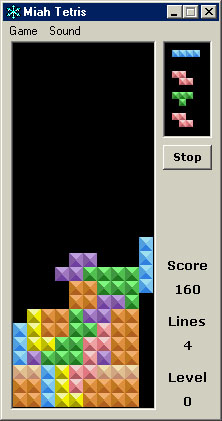



## Miah Tetris

### Description

After being disappointed with so many of the other Tetris clones out there I decided to make my own. What you'll notice different about mine is the smooth piece falling (pixel by pixel instead of block by block) and the ability to speed up the falling rate rather than having the piece instantly hit the bottom. Also, I thought it would be helpful to be able to see the next four pieces instead of only the next one. I wrote this code a while back when I was first learning VB so the code is pretty sloppy and not well documented. Sorry about that, but I hope you can still get something out of it. If you like this, please vote for me! :-)
 
### More Info
 
Use the arrow keys to move the piece. Up is rotate.

             |
---                |---
**Submitted On**   |2001-06-23 13:35:26
**By**             |[Jeremiah Hughes](https://github.com/Planet-Source-Code/PSCIndex/blob/master/ByAuthor/jeremiah-hughes.md)
**Level**          |Advanced
**User Rating**    |4.9 (84 globes from 17 users)
**Compatibility**  |VB 6\.0
**Category**       |[Games](https://github.com/Planet-Source-Code/PSCIndex/blob/master/ByCategory/games__1-38.md)
**World**          |[Visual Basic](https://github.com/Planet-Source-Code/PSCIndex/blob/master/ByWorld/visual-basic.md)
**Archive File**   |[Miah Tetri215716232001\.zip](https://github.com/Planet-Source-Code/jeremiah-hughes-miah-tetris__1-24363/archive/master.zip)

